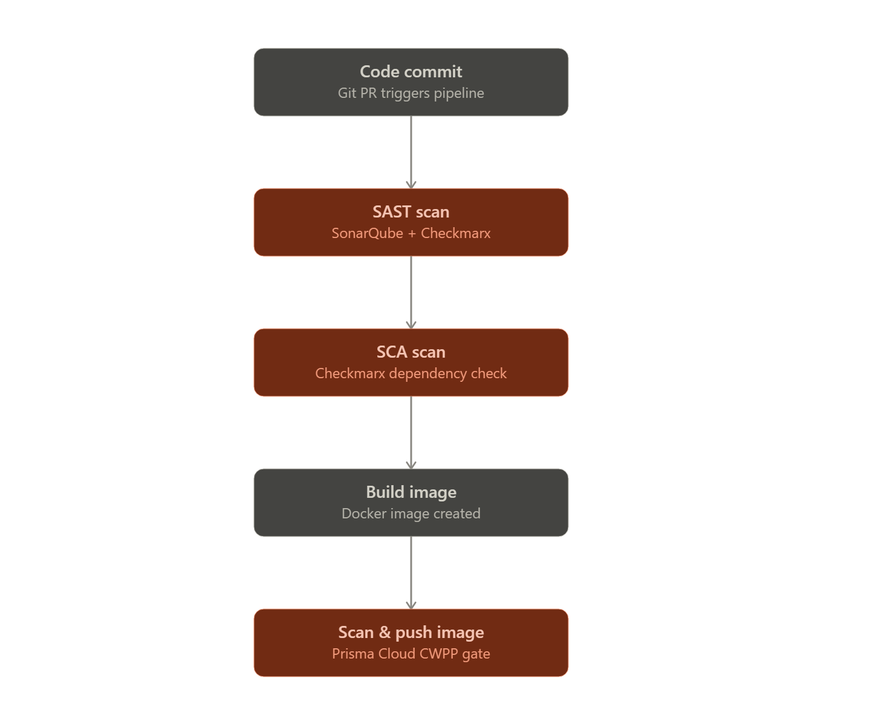
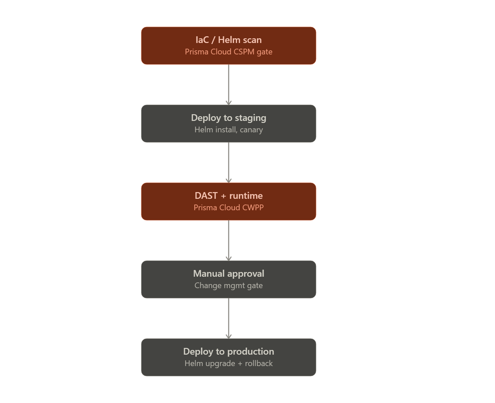

Here's how this typically comes together for a production-grade pipeline — two gates before the artifact even exists, and two more before it touches production.Coral boxes above are automated gates that can fail the build; gray boxes are ordinary pipeline steps.

**SAST (Static Application Security Testing)** — scans your *source code* itself, without running it, looking for insecure patterns: SQL injection, hardcoded secrets, broken auth logic, unsafe deserialization, XSS sinks, etc. SonarQube and Checkmarx SAST both do this, but they're complementary rather than redundant: SonarQube is strong on code quality + maintainability + a broad OWASP/CWE ruleset with a nice quality-gate UI, while Checkmarx SAST tends to have deeper data-flow/taint analysis (tracing untrusted input from source to sink) and is often the one compliance teams in banking want to see because of its audit-friendly reporting. Runs on every PR/commit, ideally in under a few minutes, blocking merge on critical/high findings.

**SCA (Software Composition Analysis)** — doesn't look at code you wrote, it looks at everything you *imported*: third-party libraries, base images, transitive dependencies. It matches what's in your `package.json`/`pom.xml`/`go.mod`/etc. against CVE databases and flags known-vulnerable versions, license issues, and sometimes typosquatted packages. Checkmarx SCA does this. Given most production breaches now trace back to a vulnerable dependency rather than a bug your team wrote, this gate is arguably as important as SAST.

Once the image is built and scanned clean, it moves into the deploy path — and that's where Prisma Cloud's two modules come in.**Prisma Cloud CWPP (Cloud Workload Protection Platform)** — protects the *running workload* itself, across its whole lifecycle:
- Image scanning (the gate in diagram 1) — CVEs and malware in the container image before it's pushed to the registry
- Runtime protection — once a pod is live, it watches for anomalous process execution, unexpected network connections, file-system tampering, container escape attempts, and can auto-quarantine a compromised pod
- Host protection — if you're not fully containerized, it also covers VM/host-level compliance and vulnerability scanning

Think of CWPP as "is this specific thing safe to run, and is it behaving safely while it runs."

**Prisma Cloud CSPM (Cloud Security Posture Management)** — doesn't look at any single workload, it looks at your *cloud configuration* as a whole: GKE cluster settings, IAM roles and bindings, network policies, public exposure of storage buckets or load balancers, encryption settings, and compliance posture against benchmarks like CIS GKE, PCI-DSS, or RBI/banking-specific frameworks. In the pipeline it shows up as a pre-deploy gate scanning your Helm chart / Terraform / K8s manifests for misconfigurations (e.g. a Service exposed as `LoadBalancer` with no restrictions, a pod running as root, missing `NetworkPolicy`), but it also runs continuously against the live cluster, independent of any deploy.

Think of CWPP as protecting the workload, CSPM as protecting the environment the workload lives in.

A few things worth locking down for this to actually be "production ready" rather than just "has scanners in it":

- **Gate policy, not just visibility** — decide per stage whether a finding blocks the pipeline (critical/high CVEs, secrets in code) or just gets logged for triage (medium/low). A scanner that only reports and never blocks isn't a gate.
- **Secrets scanning** — add a dedicated pre-commit/pre-push secrets scan (gitleaks/trufflehog, or SonarQube/Checkmarx's built-in secrets rules) — this usually gets missed when people think "SAST" covers it.
- **Image signing** — sign images with cosign after the CWPP gate passes, and enforce signature verification at the cluster admission controller so nothing unsigned can deploy, even manually.
- **Immutable, tagged images** — build once, promote the same image digest through staging → prod rather than rebuilding per environment; only Helm values change between environments.
- **GitOps repo separation** — worth flagging since it's live for you right now: your current HDFC CI/CD has the app repo and the ArgoCD config repo combined in one repo. For a clean production flow, splitting them is standard — the app repo's pipeline builds, scans, and pushes an image + bumps a tag; a separate GitOps repo holds the Helm values/manifests and is what ArgoCD actually watches. That separation is what makes the "manual approval" step in the second diagram clean (approve a PR to the GitOps repo) instead of a person triggering a CI job directly.