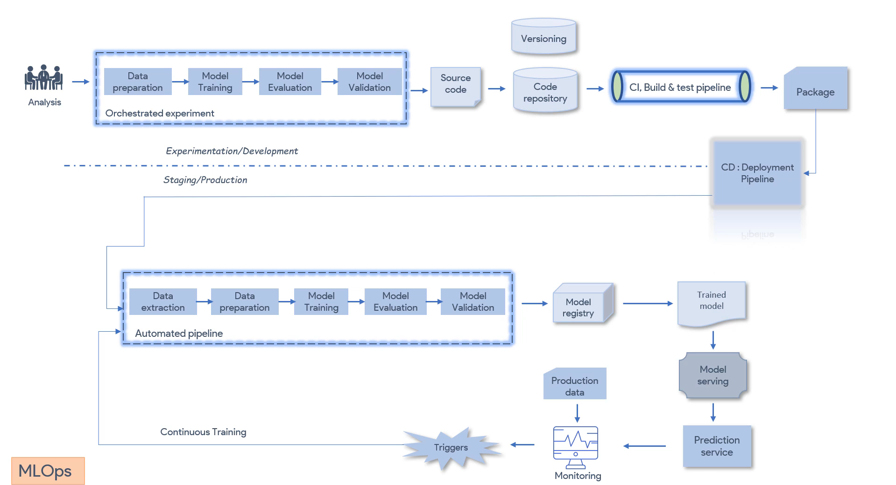

## MLOps Implementation — CI/CD/CT Pipeline

### Overall Flow (two zones — Experimentation vs Production)

```
[Dev/Experimentation Zone]
Analysis → Orchestrated Experiment → Source Code → Code Repository (Versioning) → CI Pipeline (Build & Test) → Package

--------------------------- (handoff line) ---------------------------

[Staging/Production Zone]
CD Pipeline (triggers Automated Pipeline) → Model Registry → Trained Model → Model Serving → Prediction Service → Monitoring → Triggers → Continuous Training (loops back)
```



**DevOps parallel:** This is literally your existing CI/CD flow, just with a "CT" (Continuous Training) loop bolted onto the end — because unlike normal software, an ML model degrades on its own even when the code doesn't change (data drift).

---

### 1. Orchestrated Experiment (Experimentation Zone)

This is the Data Scientist's sandbox — like a dev environment where you try things before committing.

**Flow:** Data Preparation → Model Training → Model Evaluation → Model Validation (repeated iteratively)

**Hyperparameter Tuning — explained:**
- A model has two kinds of "settings":
  - **Parameters** — learned automatically by the model during training (e.g., weights in a neural network).
  - **Hyperparameters** — set manually *before* training (e.g., learning rate, number of trees in a random forest, number of layers).
- **Hyperparameter tuning** = trying different combinations of these manual settings to find which combo gives the best model performance.
- **DevOps analogy:** Like tuning JVM heap size, thread pool count, or autoscaling thresholds — you're not changing the app code, you're changing the configuration to get better performance.
- Tools like Grid Search, Random Search, Optuna, or AutoML automate this so the data scientist doesn't manually try every combination.

**Output of this stage:** Source Code (the training/preprocessing scripts) → pushed to Code Repository with **versioning** (Git — same as your normal DevOps workflow, but here you version *data* and *model* too, not just code).

---

### 2. CI Pipeline (CI, Build & Test)

**Stages:** Test → Build → Publish

| Stage | What it does |
|---|---|
| Test | Unit tests on code, data validation tests, model sanity checks |
| Build | Package the code + dependencies |
| Publish | Push the final artifact somewhere accessible |

**Output = "Package"** → this includes packages, executables, or container images (e.g., a Docker image with your training/inference code + dependencies).

---

### ⭐ "We don't deploy the model, we deploy the pipeline" — explained

This is the most important MLOps concept, so let's break it down clearly:

- In traditional software, you build once and deploy that build.
- In ML, the **model itself is just an output artifact** (weights/binary file) — it's the *result* of running a pipeline (data extraction → prep → train → evaluate → validate).
- If you only deploy the trained model file, and the incoming data changes (drift), your model becomes stale — and you'd have to manually retrain and manually redeploy every time. That's not scalable/automatable.
- Instead, MLOps packages and deploys the **entire automated pipeline** (the sequence of steps that produces a model). This pipeline can then be **re-triggered automatically** whenever needed (new data, drift detected, schedule, etc.) to produce a fresh model — without a human manually rebuilding it.

**Simple analogy:** Don't just ship the *cake* (the model) — ship the *recipe + kitchen* (the pipeline). That way, whenever ingredients (data) change, you can bake a fresh cake automatically instead of the old one going stale.

This is exactly why the next stage is called the **CD Pipeline → triggers the Automated Pipeline**, not "deploy model."

---

### 3. CD Pipeline & Automated Pipeline (Production Zone)

**CD Pipeline:** Deploys the packaged pipeline into the staging/production environment.

**Automated Pipeline (runs in production):**
`Data Extraction → Data Preparation → Model Training → Model Evaluation → Model Validation`

Notice: it's almost identical to the "Orchestrated Experiment" from before — difference is:
- Orchestrated Experiment = manual/interactive, run by data scientist, on the dev environment
- Automated Pipeline = fully automated, no human trigger, runs in production, on live/production data

**DevOps analogy:** Same as how you'd promote a tested build from a dev/staging pipeline to an automated production pipeline that runs on schedule/trigger, not manually.

---

### 4. Model Registry, Trained Model & Serving

| Stage | What it means | Example |
|---|---|---|
| **Model Registry** | Central store for versioned, trained models (like Docker registry, but for models) | MLflow Model Registry, Vertex AI Model Registry, SageMaker Model Registry, Azure ML Registry |
| **Trained Model** | The actual output artifact (weights/binary) pulled from the registry | `model_v3.pkl`, `model.onnx` |
| **Model Serving** | Infrastructure that loads the model and makes it available to serve predictions | TensorFlow Serving, TorchServe, KServe, a REST API wrapper |
| **Prediction Service** | The actual endpoint end-users/apps call to get predictions | `/predict` API endpoint |

**Analogy:** Model Registry is like your **artifact repository** (Nexus/Artifactory) but for models. Model Serving is like your **application server** (Tomcat/Gunicorn) that runs the artifact and exposes it.

---

### 5. Monitoring & Continuous Training (CT) — Why, How, When

**Why is this important in MLOps (unlike normal DevOps)?**
- In normal software, once deployed and stable, code doesn't degrade on its own.
- In ML, the model's accuracy **degrades over time even without any code change** — because real-world data patterns shift (data drift / concept drift), as covered in Section 1 (e.g., pre vs post-COVID buying behavior).
- So "deploy and forget" doesn't work for ML — you need constant feedback from production.

**How:**
- Monitor **Production Data** flowing into the Prediction Service.
- Compare live data distribution & prediction accuracy against the original training data/baseline.
- If a significant drift or performance drop is detected → a **Trigger** fires automatically.

**When (Triggers can be):**
- Scheduled (e.g., retrain every week/month)
- Threshold-based (e.g., accuracy drops below 90%)
- Data-volume based (e.g., retrain after every 1 million new records)
- Manual trigger (data scientist notices an issue)

**Continuous Training (CT):**
- The trigger loops back to the **Automated Pipeline** (Data Extraction → ... → Model Validation), producing a fresh model automatically → pushed to Model Registry → redeployed.
- This closes the loop — hence "CI/CD/CT": Continuous Integration + Continuous Deployment + Continuous Training.

**DevOps analogy:** Think of it like an **auto-scaling + self-healing system**, but instead of restarting a crashed pod, it's "retraining a decayed model" — same philosophy of automated recovery without manual intervention.

---

### 6. Deployment Strategies (borrowed directly from DevOps — you already know these!)

| Strategy | What it means for ML models |
|---|---|
| **A/B Testing** | Route a % of traffic to a new model version vs old model, compare real prediction performance before fully switching |
| **Canary Deployment** | Roll out the new model to a small subset of users/traffic first, monitor, then gradually increase |
| **Blue-Green Deployment** | Run old model (Blue) and new model (Green) in parallel environments; switch traffic entirely once Green is verified, can instantly rollback to Blue |
| **Shadow Deployment** *(bonus, common in ML)* | New model runs in parallel with live traffic but its predictions aren't shown to users — used only to compare accuracy against the current live model, zero risk |

**Key point:** These aren't ML-specific inventions — they're the exact same deployment patterns you already use for regular application releases. MLOps just applies them to model rollout to reduce the risk of a "bad model" reaching all users.

